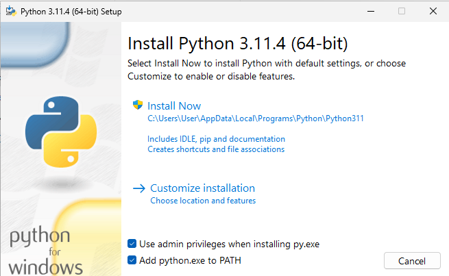
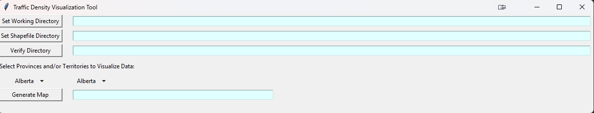
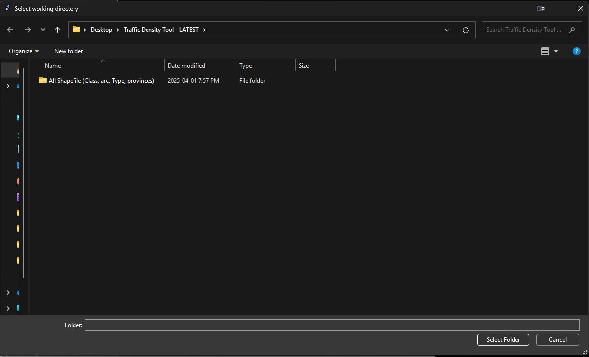
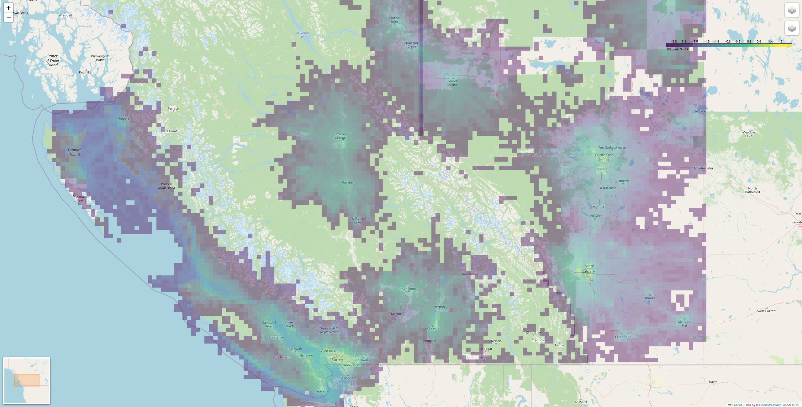
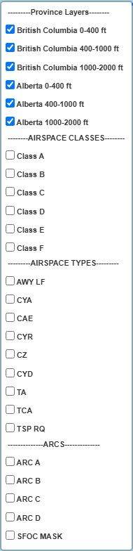

# Canadian Air Traffic Congestion Visualization Tool


## Overview
This tool generates interactive HTML maps to visualize traffic congestion data across Canadian provinces and territories. It supports custom data input and provides multiple layers for airspace classes, types, and altitude bands.

---

## Introduction
These files are used for generating the traffic congestion HTML file. The methodology is described in detail in the [public report](https://nrc-publications.canada.ca/eng/view/ft/?id=6262639a-6ad5-417a-861e-d98782811b42).
To generate a custom map, follow the **Installation** and **Execution** steps below.

---

## Installation

### **Step 1: Install Python**
1. Download the latest version of Python (code tested on **Python 3.11.4**):
   - https://www.python.org/downloads/windows/
   - https://www.python.org/downloads/release/python-3114/
2. Select the appropriate installer (64-bit or 32-bit).
3. During installation, **check the box to add python.exe to PATH**.

    
4. Click **Install Now** (requires admin privileges).

### **Step 2: Prepare Working Directory**

5. Download the GitHub folder, unzip it, and open a terminal window.
6. Create a working directory and place:
   - The Python script (`GenMap-GUI.py`)
   - Folder containing **ALL Shapefile**

### **Step 3: Install Dependencies**
7. Navigate to your working directory:
   - **Windows:** `cd <FOLDER NAME>`
   - **Mac:** `cd <FOLDER NAME>`
   Replace `<FOLDER NAME>` with the actual path (e.g., `C:\Users\%user%\%folder_name%\%sub_folder%`).
8. Run:
   ```bash
   python -m pip install -r requirements.txt
   ```
   If this fails, try:
   ```bash
   python3 -m pip install -r requirements.txt
   ```

---

## Execution

### **Option 1: Native Python Executable**
9. Double-click `GenMap-GUI.py` to launch the GUI.

    
11. Click **Set Working Directory** → select your output folder.

     
13. Click **Set ShapeFile Directory** → select the folder named *All Shapefile (Class, arc, Type, provinces)*.
14. Click **Verify Directory** → ensures all required files are present.
15. Use dropdown menus under **Select Provinces to Visualize Data** to choose two provinces/territories.
16. Click **Generate Map** → the HTML file opens automatically in your browser.

### **Option 2: Python IDLE**
15. Open **IDLE (Python 3.11 64-bit)** from your system.
16. Go to **File > Open** and select `GenMap-GUI.py`.
17. Run the code: **Run > Run Module**.
18. Follow steps 10–14 as in Option 1.

---

## Tool Overview

The following is a screenshot of the output .HTML file, along with markers that will explain what the options within the tool include. This is based on a sample file that was generated for British Columbia and Alberta.

 
- Interactive layers for altitude bands:
  - **0–400 ft**, **400–1000 ft**, **1000–2000 ft**

    
- Airspace overlays:
  - **AIRSPACE CLASSES**, **AIRSPACE TYPES**, **ARCS**
- Click any grid cell to view:
  - Normalized Traffic Congestion
  - Area (km²)
  - Congestion
  - Minimum & Maximum Altitude

---

## Collaborators


## License

[](https://opensource.org/licenses/MIT)

Permission is hereby granted, free of charge, to any person obtaining a copy of this software and associated documentation files (the "Software"), to deal in the Software without restriction, including without limitation the rights to use, copy, modify, merge, publish, distribute, sublicense, and/or sell copies of the Software, and to permit persons to whom the Software is furnished to do so, subject to the following conditions:

The above copyright notice and this permission notice shall be included in all copies or substantial portions of the Software.

THE SOFTWARE IS PROVIDED "AS IS", WITHOUT WARRANTY OF ANY KIND, EXPRESS OR IMPLIED, INCLUDING BUT NOT LIMITED TO THE WARRANTIES OF MERCHANTABILITY, FITNESS FOR A PARTICULAR PURPOSE AND NONINFRINGEMENT. IN NO EVENT SHALL THE AUTHORS OR COPYRIGHT HOLDERS BE LIABLE FOR ANY CLAIM, DAMAGES OR OTHER LIABILITY, WHETHER IN AN ACTION OF CONTRACT, TORT OR OTHERWISE,  RISING FROM, OUT OF OR IN CONNECTION WITH THE SOFTWARE OR THE USE OR OTHER DEALINGS IN THE SOFTWARE.

## Copyright

© 2025 National Research Council of Canada — Conseil national de recherches du Canada

---


